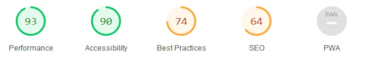
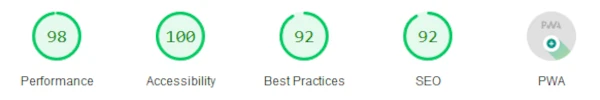

# P14-WealthHealth

<p></p>

# Projet de Conversion jQuery vers React

Ce projet représente la conversion d'une application de jQuery vers React pour une grande société financière fictive WealthHealth.

## Objectif du Projet

L'objectif principal de ce projet est de moderniser l'application existante en remplaçant les éléments basés sur jQuery par des composants React. Cela vise à améliorer la maintenabilité, la performance et la flexibilité de l'application, et réduire la dette technologique du service. Le repo JQuery se trouve [ici](https://github.com/OpenClassrooms-Student-Center/P12_Front-end).

## Développement effectué

<p align="center"></p>

- Refonte et modernisation de la page "create employee".
- Refonte et modernisation de la page "view employees".
- Application d'un style CSS commun modernisé pour les pages, cohérent avec la palette du logo.

- Gestion des states avec Redux
- Gestion de la persistance de la liste avec un backend minimal [Github : P14-P14-WealthHealth-back](https://github.com/TangiLC/P14-WealthHealth-back)
- Réalisation et publication d'un plugin sur npm, intégration dans l'application
  [npm : talec-table](https://www.npmjs.com/package/talec-table)
- Ajout d'une option de sélection de langue
- Ajout de la validation de la connexion à la base de données

- Tests unitaires et d'intégration (jest) des différents composants React
- Tests comparatifs de performance (lighthouse) entre l'archive JQuery et l'app React
<p align="center">
</p>

Une version en ligne de l'archive est disponible à cette adresse : [http://www.ocprojects.le-cadre.net/P14/](http://www.ocprojects.le-cadre.net/P14/)
Une version dev de l'appli React est hébergée chez Netlify:[https://lecadre-p14front.netlify.app/](https://lecadre-p14front.netlify.app/)

## Compétences acquises

Voici quelques-unes des réalisations clés de ce projet :

- Refonte des pages de l'application en remplaçant les plugins jQuery par des composants React.
- Codage de composants React natif personnalisables avec un recours minimal aux plugins tiers.
- Amélioration des performances de l'application ainsi que de l'accessibilité et des bonnes pratiques, mesurée par Lighthouse avant et après la conversion.
- Documentation complète du composant (table) converti, avec son fonctionnement et les personnalisations possibles. Le dépôt git est [talec-table](https://github.com/TangiLC/talec-table)
- Publication d'un plugin sur npm, et intégration dans une appli React.
- Déploiement et hébergement d'une appli React.

## Comment exécuter l'application

Pour exécuter l'application localement, suivez ces étapes :

1. Clonez le dépôt du backend sur votre machine locale.

```bash
git clone https://github.com/TangiLC/P14-WealthHealth-back
```

2. Suivre le readme pour lancer le backend dans un container Docker ou dans votre environnement

   > _Le back-end tourne sur le port 3003_

3. Clonez ce dépôt frontend sur votre machine locale.

```bash
git clone https://github.com/TangiLC/P14-WealthHealth-front
```

4. Assurez-vous d'avoir Node.js installé sur votre machine.
5. Installez et mettez à jour les dépendances en exécutant la commande :

```bash
npm install
```

6. Lancez l'application en exécutant la commande :

```bash
npm start
```

## Remerciements

Ce projet est le dernier du cursus Open Classrooms _développeur d'application -Javascript React-_ et je tiens à remercier M.**Davy Boutchoki** pour sa patience et ses conseils au cours de nos sessions de mentorat hebdomadaires.
